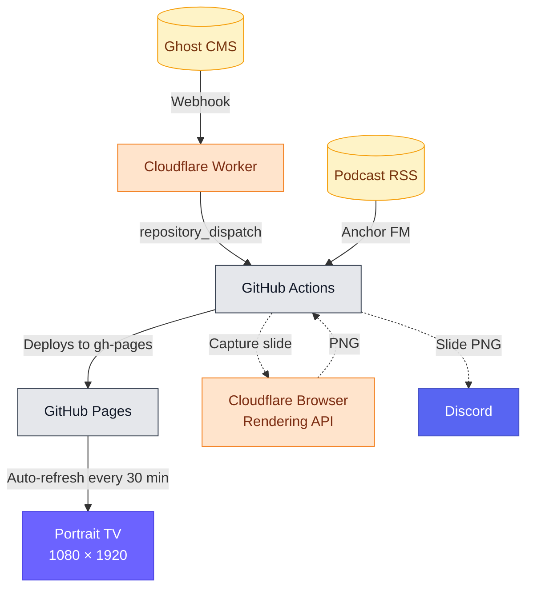

# Inovus Labs — Kiosk Display

[](https://github.com/inovus-labs/kiosk.inovuslabs.org/actions/workflows/build-and-deploy.yml)
[](https://github.com/inovus-labs/kiosk.inovuslabs.org/commits/master)
[](LICENSE)
[](https://kiosk.inovuslabs.org)

A purpose-built portrait kiosk running on a 1080 × 1920 TV screen at Inovus Labs. Content is pulled from live sources, rebuilt the moment a post is published, and deployed automatically — no manual updates, ever.


## How it works



Ghost fires a webhook on `post.published` / `post.updated` / `post.unpublished`. A small Cloudflare Worker verifies a shared-secret token and translates the event into a GitHub `repository_dispatch`, which kicks off the build. The job fetches all enabled sources, generates a fully self-contained `index.html`, and pushes it to the `gh-pages` branch — which GitHub Pages picks up and serves. After deploy, the newest blog slide is captured via Cloudflare Browser Rendering and posted to Discord as a story-ready 1080×1920 PNG.

The workflow can also be run manually via `workflow_dispatch`.


## On screen

| Content | Source | Status |
|---|---|---|
| Blog posts | Ghost CMS | ✅ Live |
| Podcast episodes | Anchor FM RSS | ✅ Live |


## Features

- Slides cycle every 10 seconds with smooth fade transitions and a progress bar. Dot indicators at the bottom track position.
- Cover images slowly zoom during each slide — keeps the screen alive without being distracting.
- Every blog slide has a scannable QR code that opens the full post on your phone, with UTM parameters for tracking.
- Podcast slides show episode artwork, duration, release date, and a QR code linking to Spotify.
- Always-on HH:MM clock in the top-right, with a blinking separator.
- Optional SomaFM radio stream running quietly in the background.
- Any screen that isn't portrait and close to 9:16 gets a friendly overlay instead of a broken layout.
- After every deploy, the newest blog slide is auto-posted to Discord — sized for Instagram stories and WhatsApp status.


## Getting started

**Prerequisites:** [Bun](https://bun.sh)

```bash
git clone https://github.com/inovus-labs/kiosk.inovuslabs.org.git
cd kiosk.inovuslabs.org
bun install
```

Set your Ghost API key as an environment variable:

```bash
export GHOST_CONTENT_API_KEY=your_key_here
```

All other settings — Ghost URL, podcast RSS feed, item limits, sound — are configured in [`config.json`](config.json):

```json
{
  "ghost":   { "enable": true, "apiUrl": "https://blog.inovuslabs.org", "postLimit": 6 },
  "podcast": { "enable": true, "rssUrl": "https://anchor.fm/s/.../podcast/rss", "episodeLimit": 6 },
  "display": { "logoUrl": "https://inovuslabs.org/assets/logo.svg", "enableSound": true }
}
```

Build and preview:

```bash
bun run build    # writes to out/
bun run preview  # build + open in browser
```


## Deployment

Handled by [`.github/workflows/build-and-deploy.yml`](.github/workflows/build-and-deploy.yml).
Triggered by `repository_dispatch` (event type `ghost-publish`, sent by the Cloudflare Worker) and by manual `workflow_dispatch`.

Set these in repository **Settings → Secrets and variables → Actions secrets**:

| Name | Description |
|---|---|
| `GHOST_CONTENT_API_KEY` | Ghost Content API key |
| `CLOUDFLARE_ACCOUNT_ID` | Cloudflare account ID — used by the Browser Rendering screenshot step |
| `CLOUDFLARE_API_TOKEN` | Cloudflare API token with Browser Rendering permissions |
| `DISCORD_WEBHOOK_URL` | Discord webhook the post-deploy screenshot is sent to |

GitHub Pages must be set to serve from the `gh-pages` branch.


## Ghost webhook bridge

The [`worker/`](worker/) directory contains a Cloudflare Worker (`kiosk-ghost-webhook`) that receives Ghost custom-integration webhooks and fires a GitHub `repository_dispatch` at this repo. Ghost is configured to POST to the Worker URL with `?token=<secret>` appended.

Deploy with [`wrangler`](https://developers.cloudflare.com/workers/wrangler/):

```bash
cd worker
bun install
bunx wrangler deploy
```

Worker secrets (set via `wrangler secret put`):

| Name | Description |
|---|---|
| `GH_TOKEN` | GitHub fine-grained PAT scoped to this repo with `Contents: write` |
| `WEBHOOK_SECRET` | Random string; same value goes into the Ghost webhook URL as `?token=` |


## Display specs

| Property | Value |
|---|---|
| Resolution | 1080 × 1920 |
| Orientation | Portrait |
| Slide duration | 10 seconds |
| Page refresh | Every 30 minutes |
| Build trigger | Ghost webhook (or manual dispatch) |


## License

This project is licensed under the MIT License. See the [LICENSE](LICENSE) file for details. Please do not use the [Inovus Labs](https://inovuslabs.org) name or branding without permission.
