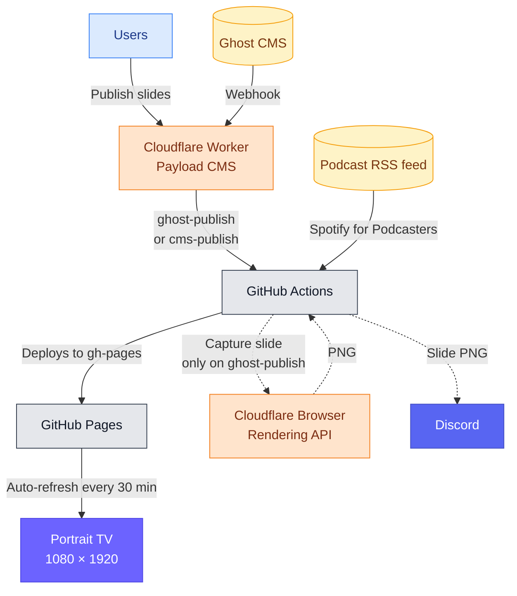

# Inovus Labs — Kiosk Display

[](https://github.com/inovus-labs/kiosk.inovuslabs.org/actions/workflows/build-and-deploy.yml)
[](https://github.com/inovus-labs/kiosk.inovuslabs.org/commits/master)
[](LICENSE)
[](https://kiosk.inovuslabs.org)

A purpose-built portrait kiosk running on a 1080 × 1920 TV screen at Inovus Labs. Content is pulled from live sources, rebuilt the moment a post is published, and deployed automatically — no manual updates, ever. Lab members can also push custom announcements, event posters, and images from a built-in CMS, with scheduling and time-to-live built in.


## How it works



The split is intentional: **the kiosk-worker only listens and triggers; the GitHub Actions job does all the fetching and building.**

The worker listens for three event sources and fires a `repository_dispatch` at this repo. **Two distinct event types** are used so the build workflow can branch on origin:

| Source | `event_type` fired |
|---|---|
| Ghost `post.published` / `post.unpublished` webhook (mid-edit `post.updated` is intentionally not subscribed) | `ghost-publish` |
| Lab member saves a slide in the Payload admin (`afterChange` hook) | `cms-publish` |
| Hourly cron detects a `publishAt` / `expiresAt` boundary crossing | `cms-publish` |

GitHub Actions accepts both event types and does the same fetch + build work either way: blog posts from Ghost, podcast episodes from the RSS feed, and published custom slides from the worker's REST API at `/api/slides`. It generates a fully self-contained `index.html` and pushes it to the `gh-pages` branch, which GitHub Pages serves. The TV auto-refreshes every 30 min as a safety net.

**Discord screenshot only fires for `ghost-publish`** — new blog posts get a story-ready 1080×1920 PNG posted to Discord; custom slide updates don't (kiosk-internal content, no notification needed).

Because the build runs in Actions and the kiosk is fully static, the worker being down only affects *new* publishing — the kiosk keeps rendering the last successful build indefinitely. Images load directly from R2's managed public URL, independent of the worker.


## On screen

| Content | Source | Status |
|---|---|---|
| Custom text-message slides (billboard layout) | Payload CMS · `kiosk-worker` | ✅ Live |
| Custom image slides (edge-to-edge poster) | Payload CMS · `kiosk-worker` | ✅ Live |
| Blog posts | Ghost CMS | ✅ Live |
| Podcast episodes | Spotify for Podcasters · RSS feed | ✅ Live |

Slide order on the kiosk: `[custom slides] → [blog posts] → [podcast episodes]`. Custom slides are sorted by `pinnedOrder asc nulls last, publishAt desc`; blogs and podcasts are newest-first within their groups.


## Features

- Slides cycle every 10 seconds with smooth fade transitions and a progress bar. Dot indicators at the bottom track position.
- Cover images slowly zoom during each slide — keeps the screen alive without being distracting.
- Every blog slide has a scannable QR code that opens the full post on your phone, with UTM parameters for tracking.
- Podcast slides show episode artwork, duration, release date, and a QR code linking to Spotify.
- Custom slides come in two flavours: a full-bleed image poster, or a centered text billboard.
- Lab members can schedule a slide for the future (`publishAt`) or set a TTL (`expiresAt`); the worker auto-rebuilds when the boundary crosses.
- Always-on HH:MM clock in the top-right, with a blinking separator.
- Optional SomaFM radio stream running quietly in the background.
- Any screen that isn't portrait and close to 9:16 gets a friendly overlay instead of a broken layout.
- After every Ghost-driven deploy, the newest blog slide is auto-posted to Discord — sized for Instagram stories and WhatsApp status. (Custom slide deploys are silent.)


## Getting started

**Prerequisites:** [Bun](https://bun.sh)

```bash
git clone https://github.com/inovus-labs/kiosk.inovuslabs.org.git
cd kiosk.inovuslabs.org
bun install
```

Set your Ghost API key as an environment variable:

```bash
export GHOST_CONTENT_API_KEY=your_key_here
```

All other settings — sources, item limits, the kiosk-CMS URL, sound — live in [`config.json`](config.json):

```json
{
  "cms":     { "enable": true, "apiUrl": "https://kiosk-worker.inovustv.workers.dev", "limit": 10 },
  "ghost":   { "enable": true, "apiUrl": "https://blog.inovuslabs.org", "postLimit": 6 },
  "podcast": { "enable": true, "rssUrl": "https://.../podcast/rss", "episodeLimit": 6 },
  "display": { "logoUrl": "https://inovuslabs.org/assets/logo.svg", "enableSound": true }
}
```

Build and preview:

```bash
bun run build    # writes to out/
bun run preview  # build + open in browser
```


## Deployment

Handled by [`.github/workflows/build-and-deploy.yml`](.github/workflows/build-and-deploy.yml).
Triggered by `repository_dispatch` (event types `ghost-publish` and `cms-publish`, both sent by the worker) and by manual `workflow_dispatch`.

Set these in repository **Settings → Secrets and variables → Actions secrets**:

| Name | Description |
|---|---|
| `GHOST_CONTENT_API_KEY` | Ghost Content API key |
| `CLOUDFLARE_ACCOUNT_ID` | Cloudflare account ID — used by the Browser Rendering screenshot step |
| `CLOUDFLARE_API_TOKEN` | Cloudflare API token with Browser Rendering permissions |
| `DISCORD_WEBHOOK_URL` | Discord webhook the post-deploy screenshot is sent to |

GitHub Pages must be set to serve from the `gh-pages` branch.


## kiosk-worker — Payload CMS + Ghost webhook bridge

The [`worker/`](worker/) directory is a [Payload CMS](https://payloadcms.com/) (Next.js + OpenNext) deployed to a Cloudflare Worker. It serves three purposes:

1. **Payload admin** at `/admin` — where lab members log in and publish custom slides (text or image, with `publishAt` and `expiresAt`).
2. **REST API** at `/api/slides` — the GitHub Actions build script fetches published+active slides from here.
3. **Ghost webhook** at `/api/webhook/ghost?token=…` — receives Ghost custom-integration webhooks and fires `repository_dispatch` at this repo.

Backed by **Cloudflare D1** (slides table) and **Cloudflare R2** (media uploads, served from a managed public URL so the kiosk loads images directly without proxying through the worker). An hourly cron checks for `publishAt`/`expiresAt` boundary crossings and triggers a rebuild when one is detected.

**Deploy** is automated via **Cloudflare Workers Builds** — pushing to `master` triggers a build that runs migrations against remote D1 and ships the worker. Configured at the worker level in the Cloudflare dashboard:

| Field | Value |
|---|---|
| Root directory | `/worker` |
| Build command | `bun run migrate && bunx opennextjs-cloudflare build` |
| Deploy command | `bunx opennextjs-cloudflare deploy` |

**Worker runtime secrets** (set in Cloudflare dashboard → kiosk-worker → Settings → Variables and Secrets):

| Name | Description |
|---|---|
| `PAYLOAD_SECRET` | Random hex string used by Payload to sign sessions |
| `WEBHOOK_SECRET` | Random string; same value goes into the Ghost webhook URL as `?token=` |
| `GH_TOKEN` | GitHub fine-grained PAT scoped to this repo with `Contents: write` |


## Display specs

| Property | Value |
|---|---|
| Resolution | 1080 × 1920 |
| Orientation | Portrait |
| Slide duration | 10 seconds |
| Page refresh | Every 30 minutes |
| Build triggers | Ghost webhook · Payload admin save · hourly TTL cron · manual dispatch |


## License

This project is licensed under the MIT License. See the [LICENSE](LICENSE) file for details. Please do not use the [Inovus Labs](https://inovuslabs.org) name or branding without permission.
