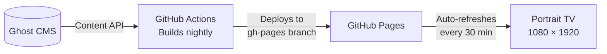

# Inovus Labs — Kiosk Display

[](https://github.com/inovus-labs/kiosk.inovuslabs.org/actions/workflows/build-and-deploy.yml)
[](https://github.com/inovus-labs/kiosk.inovuslabs.org/commits/master)
[](LICENSE)
[](https://kiosk.inovuslabs.org)

A purpose-built portrait kiosk running on a 1080 × 1920 TV screen at Inovus Labs. Content is pulled from live sources, built nightly, and deployed automatically — no manual updates, ever.

Currently showing blog posts. Built to grow.


## How it works



The workflow runs at midnight UTC every day (and on demand). It fetches content, generates a fully self-contained `index.html`, and pushes it to the `gh-pages` branch — which GitHub Pages picks up and serves.


## On screen

| Content | Source | Status |
|---|---|---|
| Blog posts | Ghost CMS | ✅ Live |
| More coming | — | 🔜 |


## Features

- Slides cycle every 10 seconds with smooth fade transitions and a progress bar. Dot indicators at the bottom track position.
- Cover images slowly zoom during each slide — keeps the screen alive without being distracting.
- Every slide has a scannable QR code that opens the full post on your phone, with UTM parameters for tracking.
- Always-on HH:MM clock in the top-right, with a blinking separator.
- Optional SomaFM radio stream running quietly in the background. Toggle with `ENABLE_SOUND`.
- Any screen that isn't portrait and close to 9:16 gets a friendly overlay instead of a broken layout.


## Getting started

**Prerequisites:** [Bun](https://bun.sh)

```bash
git clone https://github.com/inovus-labs/kiosk.inovuslabs.org.git
cd kiosk.inovuslabs.org
bun install
```

Copy the example env file and fill in your values:

```bash
cp .env.example .env
```

| Variable | Required | Description |
|---|---|---|
| `GHOST_API_URL` | Yes | Your Ghost site URL |
| `GHOST_CONTENT_API_KEY` | Yes | Ghost Content API key |
| `ENABLE_SOUND` | No | `false` to mute ambient audio (default: `true`) |

Build and preview:

```bash
bun run build    # writes to out/
bun run preview  # build + open in browser
```


## Deployment

Handled by [`.github/workflows/build-and-deploy.yml`](.github/workflows/build-and-deploy.yml).
Runs daily at midnight UTC and on manual trigger via `workflow_dispatch`.

Set these in repository **Settings → Secrets and variables**:

| Type | Name | Value |
|---|---|---|
| Secret | `GHOST_CONTENT_API_KEY` | Your Ghost API key |
| Variable | `ENABLE_SOUND` | `true` or `false` |

GitHub Pages must be set to serve from the `gh-pages` branch.


## Display specs

| Property | Value |
|---|---|
| Resolution | 1080 × 1920 |
| Orientation | Portrait |
| Slide duration | 10 seconds |
| Page refresh | Every 30 minutes |
| Deployment | Nightly at 00:00 UTC |


## License

This project is licensed under the MIT License. See the [LICENSE](LICENSE) file for details. Please do not use the [Inovus Labs](https://inovuslabs.org) name or branding without permission.
