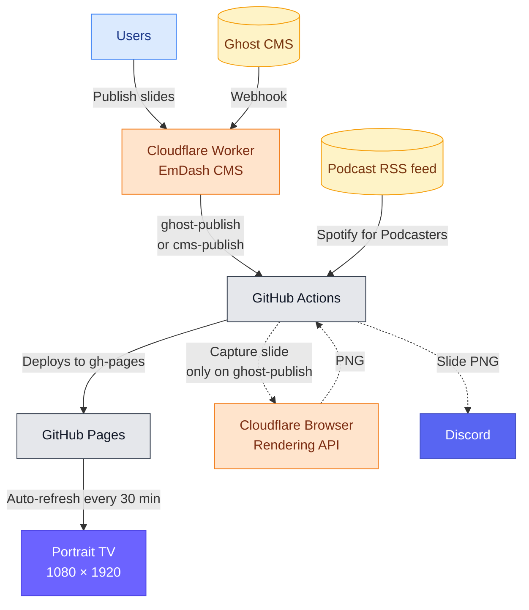
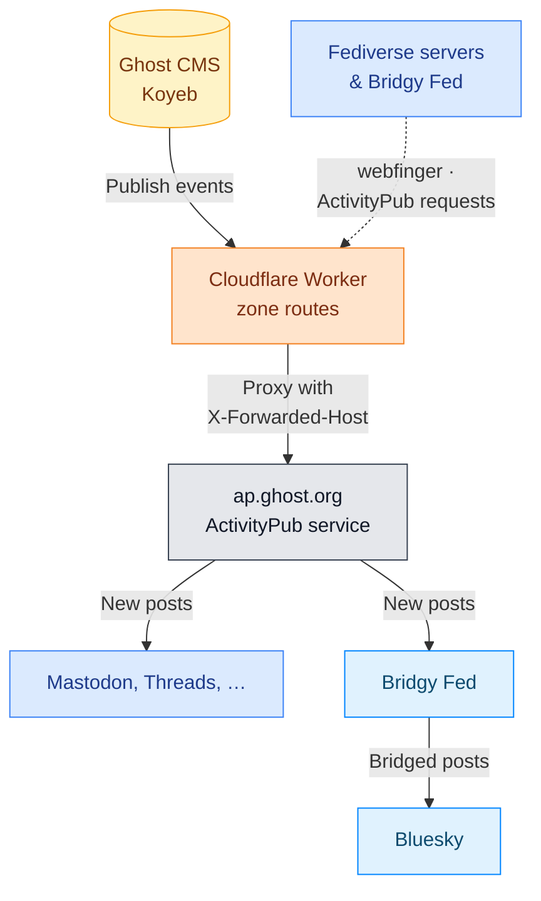

# Inovus Labs — Kiosk Display

[](https://github.com/inovus-labs/kiosk.inovuslabs.org/actions/workflows/build-and-deploy.yml)
[](https://github.com/inovus-labs/kiosk.inovuslabs.org/commits/master)
[](LICENSE)
[](https://kiosk.inovuslabs.org)

A purpose-built portrait kiosk running on a 1080 × 1920 TV screen at Inovus Labs. Content is pulled from live sources, rebuilt the moment a post is published, and deployed automatically — no manual updates, ever. Lab members can also push custom announcements, event posters, and images from a built-in CMS, with scheduling and time-to-live built in.


## How it works


```mermaid
flowchart TD
    %% ── Sources ─────────────────────────────────
    EDIT[Users]:::user
    A[(Ghost CMS)]:::source
    E[(Podcast RSS feed)]:::source

    %% ── Build & deploy pipeline ─────────────────
    W[Cloudflare Worker<br/>EmDash CMS]:::cf
    B[GitHub Actions]:::gh
    C[GitHub Pages]:::gh
    D[Portrait TV<br/>1080 × 1920]:::tv

    %% ── Post-deploy side channel ────────────────
    BR[Cloudflare Browser<br/>Rendering API]:::cf
    F[Discord]:::discord

    EDIT -->|Publish slides| W
    A -->|Webhook| W
    W -->|ghost-publish<br/>or cms-publish| B
    E -->|Spotify for Podcasters| B
    B -->|Deploys to gh-pages| C
    C -->|Auto-refresh every 30 min| D

    B -.->|Capture slide<br/>only on ghost-publish| BR
    BR -.->|PNG| B
    B -.->|Slide PNG| F

    classDef user    fill:#DBEAFE,stroke:#3B82F6,color:#1E3A8A;
    classDef source  fill:#FEF3C7,stroke:#F59E0B,color:#78350F;
    classDef cf      fill:#FFE4CC,stroke:#F38020,color:#7C2D12;
    classDef gh      fill:#E5E7EB,stroke:#374151,color:#111827;
    classDef tv      fill:#6C63FF,stroke:#4F46E5,color:#FFFFFF;
    classDef discord fill:#5865F2,stroke:#4752C4,color:#FFFFFF;
```

The split is intentional: **for the kiosk, the worker only listens and triggers; the GitHub Actions job does all the fetching and building.** (The worker also fronts the blog's [social web](#ghost-social-web) traffic, which is unrelated to the kiosk build.)

The worker listens for three event sources and fires a `repository_dispatch` at this repo. **Two distinct event types** are used so the build workflow can branch on origin:

| Source | `event_type` fired |
|---|---|
| Ghost `post.published` / `post.unpublished` webhook (mid-edit `post.updated` is intentionally not subscribed) | `ghost-publish` |
| Lab member publishes, unpublishes, or trashes a slide in the EmDash admin | `cms-publish` |
| A scheduled slide goes live, or a slide passes its `expires_at` (checked every minute) | `cms-publish` |

GitHub Actions accepts both event types and does the same fetch + build work either way: blog posts from Ghost, podcast episodes from the RSS feed, and live custom slides from the worker's `/api/slides.json` feed (poster images are downloaded into the build). It generates a fully self-contained `index.html` and pushes it to the `gh-pages` branch, which GitHub Pages serves. The TV auto-refreshes every 30 min as a safety net.

**Discord screenshot only fires for `ghost-publish`** — new blog posts get a story-ready 1080×1920 PNG posted to Discord; custom slide updates don't (kiosk-internal content, no notification needed).

Because the build runs in Actions and the kiosk is fully static, the worker being down only affects *new* publishing — the kiosk keeps rendering the last successful build indefinitely. Poster images are bundled into `out/media/` at build time, so nothing on screen is served by the worker.


## On screen

| Content | Source | Status |
|---|---|---|
| Custom text-message slides (billboard layout) | EmDash CMS · `kiosk-worker` | ✅ Live |
| Custom image slides (edge-to-edge poster) | EmDash CMS · `kiosk-worker` | ✅ Live |
| Blog posts | Ghost CMS | ✅ Live |
| Podcast episodes | Spotify for Podcasters · RSS feed | ✅ Live |

Slide order on the kiosk: `[custom slides] → [blog posts] → [podcast episodes]`. Custom slides (image and text together) are sorted by `pinned_order asc nulls last, published_at desc`; blogs and podcasts are newest-first within their groups.


## Features

- Slides cycle every 10 seconds with smooth fade transitions and a progress bar. Dot indicators at the bottom track position.
- Cover images slowly zoom during each slide — keeps the screen alive without being distracting.
- Every blog slide has a scannable QR code that opens the full post on your phone, with UTM parameters for tracking.
- Podcast slides show episode artwork, duration, release date, and a QR code linking to Spotify.
- Custom slides come in two flavours: a full-bleed image poster, or a centered text billboard.
- Lab members can schedule a slide for the future (EmDash's built-in scheduling) or set an `expires_at`; the kiosk rebuilds within a minute of either.
- Always-on HH:MM clock in the top-right, with a blinking separator.
- Optional SomaFM radio stream running quietly in the background.
- Any screen that isn't portrait and close to 9:16 gets a friendly overlay instead of a broken layout.
- After every Ghost-driven deploy, the newest blog slide is auto-posted to Discord — sized for Instagram stories and WhatsApp status. (Custom slide deploys are silent.)


## Getting started

**Prerequisites:** [Bun](https://bun.sh)

```bash
git clone https://github.com/inovus-labs/kiosk.inovuslabs.org.git
cd kiosk.inovuslabs.org
bun install
```

Set your Ghost API key as an environment variable:

```bash
export GHOST_CONTENT_API_KEY=your_key_here
```

All other settings — sources, item limits, the kiosk-CMS URL, sound — live in [`config.json`](config.json):

```json
{
  "cms":     { "enable": true, "apiUrl": "https://kiosk-cms.inovuslabs.org", "limit": 10 },
  "ghost":   { "enable": true, "apiUrl": "https://blog.inovuslabs.org", "postLimit": 6 },
  "podcast": { "enable": true, "rssUrl": "https://.../podcast/rss", "episodeLimit": 6 },
  "display": { "logoUrl": "https://inovuslabs.org/assets/logo.svg", "enableSound": true }
}
```

Build and preview:

```bash
bun run build    # writes to out/
bun run preview  # build + open in browser
```


## Deployment

Handled by [`.github/workflows/build-and-deploy.yml`](.github/workflows/build-and-deploy.yml).
Triggered by `repository_dispatch` (event types `ghost-publish` and `cms-publish`, both sent by the worker) and by manual `workflow_dispatch`.

Set these in repository **Settings → Secrets and variables → Actions secrets**:

| Name | Description |
|---|---|
| `GHOST_CONTENT_API_KEY` | Ghost Content API key |
| `CLOUDFLARE_ACCOUNT_ID` | Cloudflare account ID — used by the Browser Rendering screenshot step |
| `CLOUDFLARE_API_TOKEN` | Cloudflare API token with Browser Rendering permissions |
| `DISCORD_WEBHOOK_URL` | Discord webhook the post-deploy screenshot is sent to |

GitHub Pages must be set to serve from the `gh-pages` branch.


## kiosk-worker — EmDash CMS + Ghost bridges

The [`worker/`](worker/) directory is an [EmDash](https://emdashcms.com/) site (Astro, server-rendered) deployed to a Cloudflare Worker at **[kiosk-cms.inovuslabs.org](https://kiosk-cms.inovuslabs.org)**, backed by **D1** (`kiosk-db`), a private **R2** bucket (`kiosk-media`), and a **KV** namespace (`kiosk-sessions`) for admin sessions, all in the Inovus Labs IEDC Cloudflare account and pinned by ID in [`wrangler.jsonc`](worker/wrangler.jsonc). It serves five purposes:

1. **EmDash admin** at `/_emdash/admin` — lab members sign in with a passkey and manage slides in two collections under the **Slides** folder: **Image slides** (a poster) and **Text slides** (headline, body, theme), so each form only shows its own fields. Drafts, revisions, scheduled publishing, and the media library are built in. Leave **Expires at** empty to keep a slide up indefinitely; a lower **Pinned order** shows first (empty = newest first); an empty **Theme** renders as Midnight.
2. **Slide feed** at `/api/slides.json` — the live slides, already filtered and ordered, read by the GitHub Actions build.
3. **Ghost webhook** at `https://kiosk-cms.inovuslabs.org/api/webhook/ghost?token=…` — receives Ghost custom-integration webhooks and fires `repository_dispatch` at this repo.
4. **Kiosk plugin** ([`src/plugins/kiosk.ts`](worker/src/plugins/kiosk.ts)) — fires `cms-publish` on slide publish, unpublish, and trash, and unpublishes slides whose `expires_at` has passed. A one-minute Cron Trigger drives both EmDash's scheduled publishing and the expiry sweep, so scheduled and expiring slides reach the kiosk within a minute plus build time.
5. **Ghost social web proxy** ([`src/lib/activitypub.ts`](worker/src/lib/activitypub.ts)) — Cloudflare routes send the blog's ActivityPub paths to Ghost's hosted ActivityPub service. See [Ghost social web](#ghost-social-web).

The content model lives in [`seed/seed.json`](worker/seed/seed.json) and is applied on first boot; there are no migration files to maintain. To change it on a live site, see [Evolving a deployed site](https://docs.emdashcms.com/deployment/schema-evolution/).

**Local development** (from `worker/`):

```bash
bun install
bunx emdash secrets generate --write .env   # once; also add WEBHOOK_SECRET, GH_TOKEN and
                                             # EMDASH_SITE_URL=http://localhost:4321 to .env
bun run dev                                  # admin at http://localhost:4321/_emdash/admin
```

> Publishing a slide locally fires a real `repository_dispatch` if `.env` holds a valid `GH_TOKEN`. Use a dummy token unless you want a real rebuild.

**Deploy** is automated via **Cloudflare Workers Builds** — pushing to `master` triggers a build that ships the worker. EmDash applies its database migrations and the seed on the first request after a deploy. Open `/_emdash/admin` afterwards to run the setup wizard and register the first admin passkey. Invite other lab members from **Users → Invite** (copy the invite link — no email provider is configured). Configured at the worker level in the Cloudflare dashboard:

| Field | Value |
|---|---|
| Root directory | `/worker` |
| Build command | `bun run build` |
| Deploy command | `bunx wrangler deploy` |

**Worker runtime secrets** (set in Cloudflare dashboard → kiosk-worker → Settings → Variables and Secrets, or `bunx wrangler secret put <NAME>`):

| Name | Description |
|---|---|
| `EMDASH_ENCRYPTION_KEY` | Generate with `bunx emdash secrets generate`; encrypts plugin secrets. Back it up. |
| `WEBHOOK_SECRET` | Random string; same value goes into the Ghost webhook URL as `?token=` |
| `GH_TOKEN` | GitHub fine-grained PAT scoped to this repo with `Contents: write` |

### Ghost social web

The blog ([blog.inovuslabs.org](https://blog.inovuslabs.org)) runs as a single Ghost container on Koyeb. Ghost 6's social web (Network) needs a reverse proxy that sends its ActivityPub paths to a separate service — Ghost's own Docker setup does this with Caddy — so the worker takes that role through zone routes in [`wrangler.jsonc`](worker/wrangler.jsonc):

| Route | Handling |
|---|---|
| `blog.inovuslabs.org/.ghost/activitypub/*` | Proxied to `ACTIVITYPUB_TARGET` (`https://ap.ghost.org`) with `X-Forwarded-Host`, which is how the service identifies the site |
| `blog.inovuslabs.org/.well-known/webfinger*` | Same |
| `blog.inovuslabs.org/.well-known/nodeinfo*` | Same |
| `inovuslabs.org/.well-known/webfinger*` | `302` to the blog's webfinger, required by Ghost's custom handle domain (`SOCIAL_WEB_DOMAIN`) |

Trailing slashes are stripped before proxying: browsers that opened Network before the proxy existed hold Ghost's year-long `301` that adds one, and the service redirects it away again.


```mermaid
flowchart TD
    %% ── Sources ─────────────────────────────────
    A[(Ghost CMS<br/>Koyeb)]:::source
    R[Fediverse servers<br/>& Bridgy Fed]:::user

    %% ── Proxy & ActivityPub service ─────────────
    W[Cloudflare Worker<br/>zone routes]:::cf
    AP[ap.ghost.org<br/>ActivityPub service]:::gh

    %% ── Delivery ────────────────────────────────
    FV[Mastodon, Threads, …]:::user
    BF[Bridgy Fed]:::bsky
    BS[Bluesky]:::bsky

    A -->|Publish events| W
    R -.->|webfinger ·<br/>ActivityPub requests| W
    W -->|Proxy with<br/>X-Forwarded-Host| AP
    AP -->|New posts| FV
    AP -->|New posts| BF
    BF -->|Bridged posts| BS

    classDef user    fill:#DBEAFE,stroke:#3B82F6,color:#1E3A8A;
    classDef source  fill:#FEF3C7,stroke:#F59E0B,color:#78350F;
    classDef cf      fill:#FFE4CC,stroke:#F38020,color:#7C2D12;
    classDef gh      fill:#E5E7EB,stroke:#374151,color:#111827;
    classDef bsky    fill:#E0F2FE,stroke:#0085FF,color:#0C4A6E;
```

Blog pages themselves never touch the worker; only the routes above do.

| Network | Account |
|---|---|
| Fediverse (Mastodon, Threads, …) | `@blog@inovuslabs.org` |
| Bluesky, via [Bridgy Fed](https://fed.brid.gy) | [`@blog.inovuslabs.org.ap.brid.gy`](https://bsky.app/profile/blog.inovuslabs.org.ap.brid.gy) |

New posts reach both automatically; Bluesky follows a few minutes behind.


## Display specs

| Property | Value |
|---|---|
| Resolution | 1080 × 1920 |
| Orientation | Portrait |
| Slide duration | 10 seconds |
| Page refresh | Every 30 minutes |
| Build triggers | Ghost webhook · slide publish / unpublish / trash · scheduled publish · expiry · manual dispatch |


## License

This project is licensed under the MIT License. See the [LICENSE](LICENSE) file for details. Please do not use the [Inovus Labs](https://inovuslabs.org) name or branding without permission.
