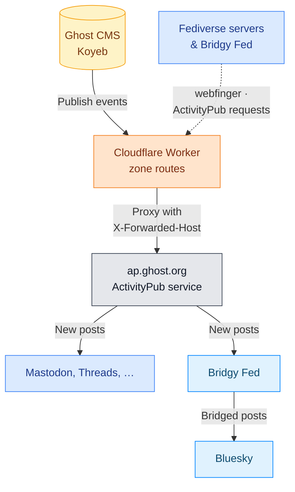

# Kiosk Worker — EmDash CMS + Ghost bridges

This directory is an [EmDash](https://emdashcms.com/) site (Astro, server-rendered) deployed to a Cloudflare Worker at **[kiosk-cms.inovuslabs.org](https://kiosk-cms.inovuslabs.org)**, backed by **D1** (`kiosk-db`), a private **R2** bucket (`kiosk-media`), and a **KV** namespace (`kiosk-sessions`) for admin sessions, all in the Inovus Labs IEDC Cloudflare account and pinned by ID in [`wrangler.jsonc`](wrangler.jsonc). It's part of the [kiosk display](../README.md) and serves five purposes:

1. **EmDash admin** at `/_emdash/admin` — lab members sign in with a passkey and manage slides in two collections under the **Slides** folder: **Image slides** (a poster) and **Text slides** (headline, body, theme), so each form only shows its own fields. Drafts, revisions, scheduled publishing, and the media library are built in. Leave **Expires at** empty to keep a slide up indefinitely; a lower **Pinned order** shows first (empty = newest first); an empty **Theme** renders as Midnight.
2. **Slide feed** at `/api/slides.json` — the live slides, already filtered and ordered, read by the GitHub Actions build.
3. **Ghost webhook** at `https://kiosk-cms.inovuslabs.org/api/webhook/ghost?token=…` — receives Ghost custom-integration webhooks and fires `repository_dispatch` at this repo.
4. **Kiosk plugin** ([`src/plugins/kiosk.ts`](src/plugins/kiosk.ts)) — fires `cms-publish` on slide publish, unpublish, and trash, and unpublishes slides whose `expires_at` has passed. A one-minute Cron Trigger drives both EmDash's scheduled publishing and the expiry sweep, so scheduled and expiring slides reach the kiosk within a minute plus build time.
5. **Ghost social web proxy** ([`src/lib/activitypub.ts`](src/lib/activitypub.ts)) — Cloudflare routes send the blog's ActivityPub paths to Ghost's hosted ActivityPub service. See [Ghost social web](#ghost-social-web).

The content model lives in [`seed/seed.json`](seed/seed.json) and is applied on first boot; there are no migration files to maintain. To change it on a live site, see [Evolving a deployed site](https://docs.emdashcms.com/deployment/schema-evolution/).

**Local development** (from this directory):

```bash
bun install
bunx emdash secrets generate --write .env   # once; also add WEBHOOK_SECRET, GH_TOKEN and
                                             # EMDASH_SITE_URL=http://localhost:4321 to .env
bun run dev                                  # admin at http://localhost:4321/_emdash/admin
```

> Publishing a slide locally fires a real `repository_dispatch` if `.env` holds a valid `GH_TOKEN`. Use a dummy token unless you want a real rebuild.

**Deploy** is automated via **Cloudflare Workers Builds** — pushing to `master` triggers a build that ships the worker. EmDash applies its database migrations and the seed on the first request after a deploy. Open `/_emdash/admin` afterwards to run the setup wizard and register the first admin passkey. Invite other lab members from **Users → Invite** (copy the invite link — no email provider is configured). Configured at the worker level in the Cloudflare dashboard:

| Field | Value |
|---|---|
| Root directory | `/worker` |
| Build command | `bun run build` |
| Deploy command | `bunx wrangler deploy` |

**Worker runtime secrets** (set in Cloudflare dashboard → kiosk-worker → Settings → Variables and Secrets, or `bunx wrangler secret put <NAME>`):

| Name | Description |
|---|---|
| `EMDASH_ENCRYPTION_KEY` | Generate with `bunx emdash secrets generate`; encrypts plugin secrets. Back it up. |
| `WEBHOOK_SECRET` | Random string; same value goes into the Ghost webhook URL as `?token=` |
| `GH_TOKEN` | GitHub fine-grained PAT scoped to this repo with `Contents: write` |

## Ghost social web

The blog ([blog.inovuslabs.org](https://blog.inovuslabs.org)) runs as a single Ghost container on Koyeb. Ghost 6's social web (Network) needs a reverse proxy that sends its ActivityPub paths to a separate service — Ghost's own Docker setup does this with Caddy — so the worker takes that role through zone routes in [`wrangler.jsonc`](wrangler.jsonc):

| Route | Handling |
|---|---|
| `blog.inovuslabs.org/.ghost/activitypub/*` | Proxied to `ACTIVITYPUB_TARGET` (`https://ap.ghost.org`) with `X-Forwarded-Host`, which is how the service identifies the site |
| `blog.inovuslabs.org/.well-known/webfinger*` | Same |
| `blog.inovuslabs.org/.well-known/nodeinfo*` | Same |
| `inovuslabs.org/.well-known/webfinger*` | `302` to the blog's webfinger, required by Ghost's custom handle domain (`SOCIAL_WEB_DOMAIN`) |

Trailing slashes are stripped before proxying: browsers that opened Network before the proxy existed hold Ghost's year-long `301` that adds one, and the service redirects it away again.



Blog pages themselves never touch the worker; only the routes above do.

| Network | Account |
|---|---|
| Fediverse (Mastodon, Threads, …) | `@blog@inovuslabs.org` |
| Bluesky, via [Bridgy Fed](https://fed.brid.gy) | [`@blog.inovuslabs.org.ap.brid.gy`](https://bsky.app/profile/blog.inovuslabs.org.ap.brid.gy) |

New posts reach both automatically; Bluesky follows a few minutes behind.
